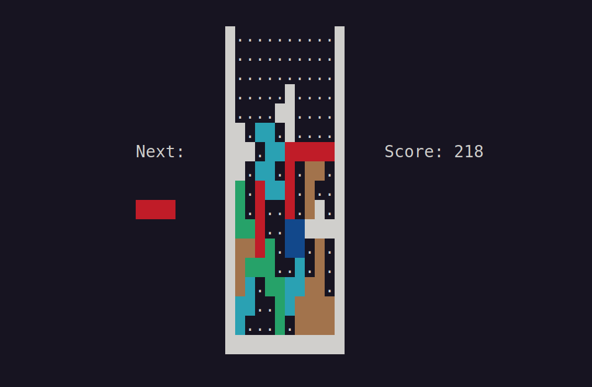

Tetris
======

## Tetris on C++

### Screenshot



### Control

| Key | Action |
|---|---|
| Arrow UP,    W/w, K/k | turn right |
| Arrow DOWN,  S/s, J/j | turn left  |
| Arrow LEFT,  A/a, H/h | move left  |
| Arrow RIGHT, D/d, L/l | move right |
| Space                 | push brick |

### Build

```bash
git clone https://github.com/17seannnn/tetris
cd tetris/src
make
./tetris
```

### Dependencies

- g++ or another C++ compiler
- make
- ncurses library (usually it's already installed)
